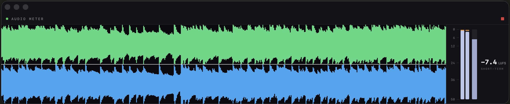

# AudioMeter

A lightweight macOS system-audio metering app built with SwiftUI. It captures system audio and displays a smooth, scrolling stereo waveform (DAW/oscilloscope style) alongside a stereo peak meter and a BS.1770-4 short-term LUFS meter.



## Features

- **Scrolling stereo waveform** — DAW-style min/max peak rendering, smooth 60fps scroll.
- **Stereo peak meter (PPM)** — fast per-channel peak level in dBFS with instant attack, slow release, and an orange peak-hold line. Tracks the signal like the waveform.
- **Short-term LUFS** — BS.1770-4 K-weighting (3 s window), shown with a numeric readout.
- **Consistent level across output devices** — compensates for the Core Audio tap's channel-pair attenuation (internal speakers vs multi-output interfaces), so readings match regardless of the current output device, and **auto re-calibrates** when you switch devices.
- **Any sample rate** — K-weighting and capture adapt to the device's actual rate (44.1 / 48 / 88.2 / 96 kHz …); waveform scroll speed stays constant.
- **Clean signal** — a per-channel DC blocker removes any DC offset so silent channels read truly empty.
- **Lightweight** — ~11–15% CPU (Release build). Audio processing is near-free; the cost is purely GPU rendering.
- **Floating always-on-top window** so it stays visible over other apps.
- **Robust startup** — a watchdog auto-restarts capture if the CoreAudio tap doesn't begin streaming, so audio always starts on first launch.

## Tech

- **SwiftUI** on macOS 14.2+
- **CATapDescription + AudioHardwareCreateProcessTap + AVAudioEngine** for pure-audio system capture (no video pipeline)
- **Metal** fragment shader rendering a ring buffer for the waveform (GPU-accelerated, DAW-style min/max binning)
- **Accelerate / vDSP** — SIMD biquad K-weighting filter (LUFS), plus `vDSP_minv`/`vDSP_maxv` and `vDSP_maxmgv` for waveform and peak metering, and `vDSP_vsmul` for level compensation
- **Adaptive K-weighting** — BS.1770-4 coefficients computed via bilinear transform for the active sample rate (identical to the ITU values at 48 kHz)
- **Level compensation** — reads the default output device's channel count (`kAudioDevicePropertyStreamConfiguration`) and a `kAudioHardwarePropertyDefaultOutputDevice` listener to re-calibrate on device change
- **DC blocker** — one-pole high-pass (~4 Hz) per channel before metering

## Build & Run

> ⚠️ Always run the **Release** build for low CPU usage. Debug builds are many times heavier because Swift numeric code runs unoptimized.

From the terminal:

```bash
xcodebuild -project AudioMeter.xcodeproj -scheme AudioMeter -configuration Release -derivedDataPath build_release build
```

Then launch `build_release/Build/Products/Release/AudioMeter.app` (or copy it to `/Applications`).

Or in Xcode: **Product → Scheme → Edit Scheme → Run → Build Configuration → Release**, then Run.

## Permissions

The app requires audio capture permission to tap system audio. macOS may show a "Currently Sharing" indicator while capturing — this is by design for any global system-audio capture.

## License

MIT
